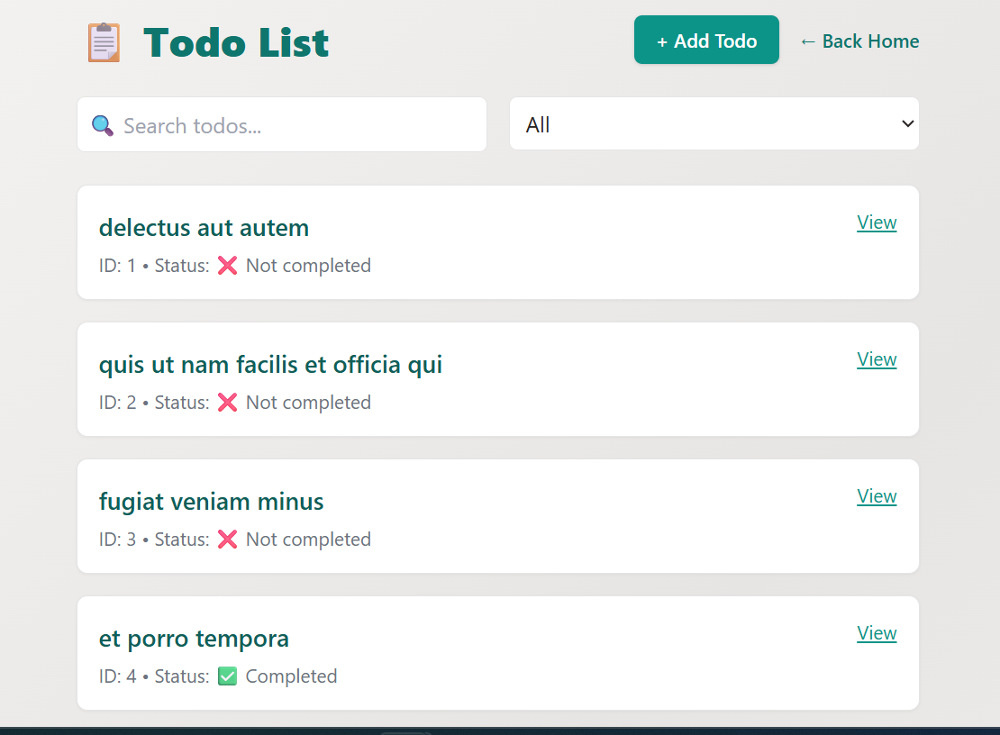

# 📝 Todo App

A simple and modern Todo application built with **React**, **Vite**, **Tailwind CSS**, **ShadCN UI**, and **TanStack Query**.  
It fetches todos from the [JSONPlaceholder](https://jsonplaceholder.typicode.com/todos) API and displays them in a clean, user-friendly interface.

This app also includes basic functionality to **add new todos** (non-persistent), as well as features to **search** by title and **filter** by completion status.

---

## 🚀 Features

- ✅ Fetch and display todos from the JSONPlaceholder API  
- ➕ Add new todos with a modal form  
- 🚦 Routing with **React Router** (declarative mode)  
- 🔍 Efficient data fetching and caching with **TanStack Query**  
- ⚡ API calls handled with **Axios**  
- 💄 Modern UI built using **Tailwind CSS** and **ShadCN UI components**  
- 🔧 Developed with **Vite** for fast build and dev experience    

---

## 🧪 Tech Stack

- **React**  
- **Vite**  
- **React Router DOM**  
- **Axios**  
- **@tanstack/react-query**  
- **Tailwind CSS**  
- **ShadCN UI**  
- **JSONPlaceholder API**

---

## 📁 Folder Structure

```bash
src/
├── components/    # Reusable components (e.g., Navbar, modals, UI elements)
├── pages/         # Route-based pages (e.g., Home.jsx, Todos.jsx)
├── App.jsx        # Main app component with route definitions
├── main.jsx       # React entry point
└── index.css      # Tailwind base and custom styles
```

---

## 📦 Installation

1. **Clone the repository**
   ```bash
   git clone https://github.com/mavic01/second-semester-exam.git
   cd second-semester-exam
   ```

2. **Install dependencies**
   ```bash
   npm install
   ```

3. **Start the development server**
   ```bash
   npm run dev
   ```

---

## 📸 Preview



---

## ⚠️ Limitations

- This app uses JSONPlaceholder, a mock API. While you can **fetch todos** (all or by ID) and **add new todos**, newly added todos are not persisted and will disappear on page refresh.

---

## 🌱 Future Improvements

- Implement full **CRUD** functionality using a real backend or a local state workaround  
- Improve UI/UX with animations  
- Add **form validation** for creating and editing todos
- Implement **edit** and **delete** functionality for todos  
- Enable **data persistence** using local storage or a real database 

---

## 👤 Author

**Victor Iberi**  
Frontend Web Developer  
- GitHub: [mavic01](https://github.com/mavic01)  
- Portfolio: [mavic-portfolio.vercel.app](https://mavic-portfolio.vercel.app/)

---

## 🙌 Acknowledgements

- [JSONPlaceholder](https://jsonplaceholder.typicode.com/)  
- [TanStack Query](https://tanstack.com/query)  
- [ShadCN UI](https://ui.shadcn.com/)  
- [Tailwind CSS](https://tailwindcss.com/)
